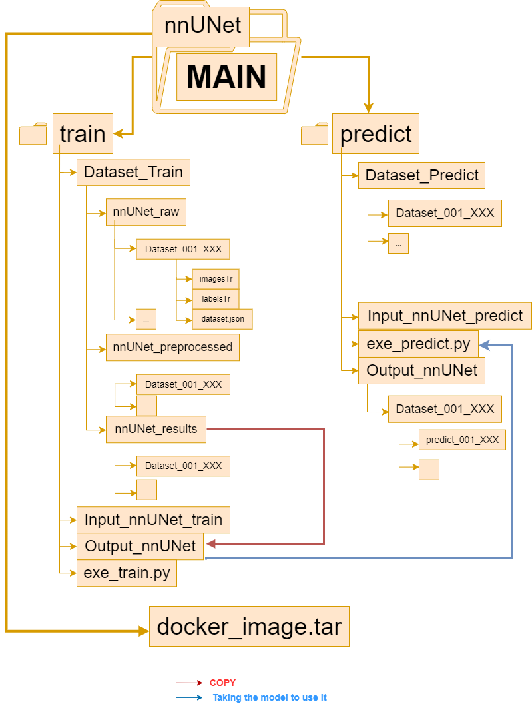

# nnUNet_MedSeg Overview

Welcome to the `nnUNet_MedSeg` repository. This Toolkit facilitates the user-friendly deployment of the [nnUNetv2](https://github.com/MIC-DKFZ/nnUNet) model.

## Purpose of the Toolkit

This script simplifies the implementation of the nnUNetv2 model designed for biomedical image segmentation. Its primary goal is to assist users in utilizing the model without diving into its underlying implementation details. To get started, users need to organize their dataset according to specified folder naming conventions and place it into the designated input folders of the script.

## Toolkit Workflow

The Toolkit comprises three main components:

1. **<u><b>Training Files</b></u>**: Set up your dataset by copying it into `Input_nnUNet_train` and then execute `exe_train.py` to obtain the output file.
2. **<u><b>Prediction Files</b></u>**: After training, users can perform predictions. Copy a test dataset into `Input_nnUNet_predict` to generate prediction images.
3. **<u><b>Docker Image</b></u>**: Contains essential software that the script relies upon, including Pytorch version 2.0.0, CUDA version 11.8, and the nnUNet model.

## Training Directory

The training directory houses various subfolders essential for the seamless execution of the nnUNet. The structure is visualized in the provided image. Users should mainly interact with `Input_nnUNet_train`, `exe_train.py`, and its output counterpart. It's pivotal to **copy** datasets into `Input_nnUNet_train`, as the script will format the data for the nnUNet and subsequently remove it post-operation.

## Prediction Directory

The prediction directory mirrors the training one. Users should place a **copy** of their test dataset in `Input_nnUNet_predict`. Once `exe_predict.py` is run, the resultant predicted images (or labels) will populate `Output_nnUNet_predict`.

## Docker Image Directory

This directory contains a Docker image designed to consolidate the necessary software tools for this script. Once loaded onto the user's system, it streamlines the entire process.

# Interactions

- After training, the `results_nnUNet` content is transferred to the `Output_nnUNet_train` folder. This step grants users the ability to conveniently copy the results to their local desktop.
- The `Output_nnUNet_train`, containing the trained model, integrates seamlessly with the predict folder, enabling its application on new images. Essential files from `Output_nnUNet_train` are copied to the 'model' directory within the predict repository.

---

## Let's Get Started! 🌟
- [Training 101: The Basics](documentation/training.md)
- [Begin with Your Own Dataset](documentation/train_new_dataset.md)
- [Unraveling Model Predictions](documentation/predictive_segmentation.md)

## Go the Extra Mile! 🚀
- [Leverage Pretrained Powerhouses](documentation/pretrained_model.md)

---

If you employ nnU-Net in your work, kindly reference the [associated paper](https://www.google.com/url?q=https://www.nature.com/articles/s41592-020-01008-z&sa=D&source=docs&ust=1677235958581755&usg=AOvVaw3dWL0SrITLhCJUBiNIHCQO):

    Isensee, F., Jaeger, P. F., Kohl, S. A., Petersen, J., & Maier-Hein, K. H. (2021). nnU-Net: a self-configuring 
    method for deep learning-based biomedical image segmentation. Nature methods, 18(2), 203-211.

