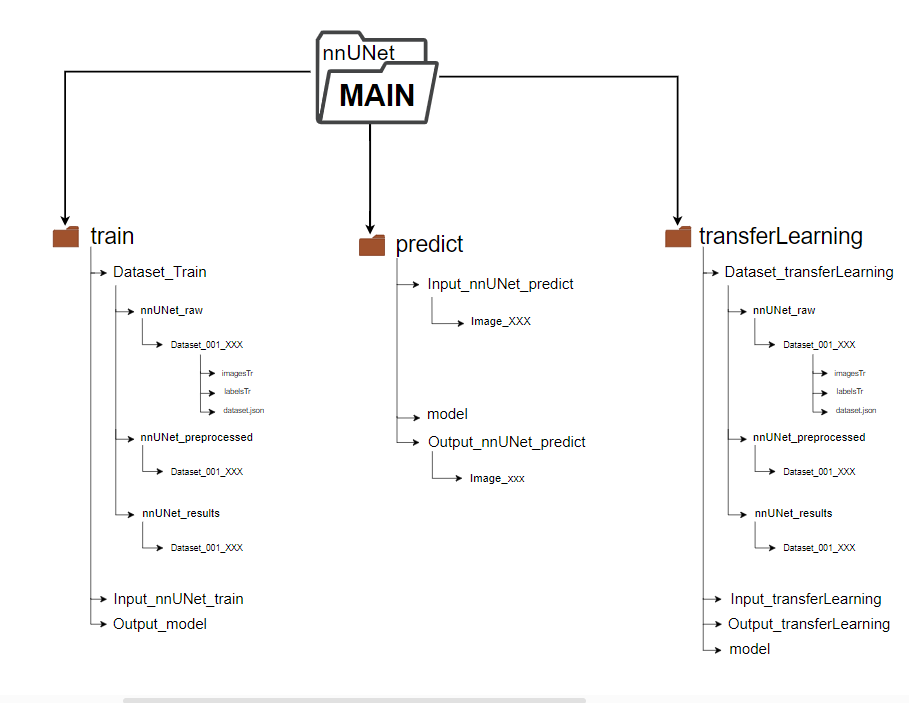
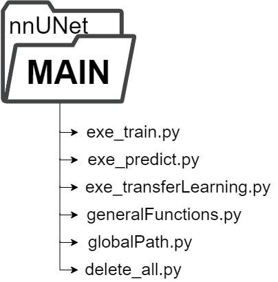

# nnUNet_MedSeg Overview

Welcome to the `nnUNet_MedSeg` repository. This Toolkit facilitates the user-friendly deployment of the [nnUNetv2](https://github.com/MIC-DKFZ/nnUNet) model.

## Purpose of the Toolkit

This script simplifies the implementation of the nnUNetv2 model designed for biomedical image segmentation. Its primary goal is to assist users in utilizing the model without diving into its underlying implementation details. To get started, users need to organize their dataset according to specified folder naming conventions and place it into the designated input folders of the script.

## Toolkit Workflow

The Toolkit comprises 3 main components:

1. **<u><b>Training Files</b></u>**: Set up your dataset by copying it into `Input_nnUNet_train` and then execute `exe_train.py` to obtain the output file.
2. **<u><b>Prediction Files</b></u>**: After training, users can perform predictions. Copy a test dataset into `Input_nnUNet_predict` to generate prediction images.
3. **<u><b>Transfer Learning Files</b></u>**: To fine-tune a model with new data.  "
4. **<u><b>Docker Image</b></u>**: Contains essential software that the script relies upon, including Pytorch version 2.0.0, CUDA version 11.8, and the nnUNet model.

## Docker Image Directory

This directory contains a Docker image designed to consolidate the necessary software tools for this script. Once loaded onto the user's system, it streamlines the entire process.

## Training Directory

The training directory houses various subfolders essential for the seamless execution of the nnUNet. The structure is visualized in the provided image. Users should mainly interact with `Input_nnUNet_train`, `exe_train.py`, and its output counterpart. It's pivotal to **copy** datasets into `Input_nnUNet_train`, as the script will format the data for the nnUNet.

## Prediction Directory 

The prediction directory mirrors the training one. Users should place a **copy** of his test picture in `Input_nnUNet_predict`. Once `exe_predict.py` is run, the resultant predicted image will be in `Output_nnUNet_predict`. The `model` folder is where the users have to copy the model located in the output of the training folder. 

## Transfer Leaerning Directory 
The Transfer Leaerning directory mirrors other directories. Users should place their new dataset[^1] in `input_transferLearning` to fine-tune an existing model. Like in the prediction directory, the `model` folder is where the users have to copy the model located in the output of the training folder. 

[^1]: The new dataset must include the same images as the original model, supplemented with completely new data.

# Important Note ⚠️ 
Please be aware that in every mentioned directory, all data will be completly deleted. Only the files in the output sections of each directory will be retained.

# Scripts

In the `main_nnUNet` folder, you will find various scripts that are set to be executed.

Detailed explanations for each script can be found in the following folders:
- [exe_train](documentation/code_explanation/exe_train.md)
- [exe_predict](documentation/code_explanation/exe_predict.md)
- [exe_transferLearning](documentation/code_explanation/exe_transferLearning.md)
- [generalFunctions](documentation/code_explanation/generalFunctions.md)
- [globalPath](documentation/code_explanation/globalPath.md)
- [delete_all](documentation/code_explanation/delete_all.md)

## Let's Get Started! 🌟
- [Training: The Basics](documentation/training.md)
- [Begin with Your Own Dataset](documentation/train_new_dataset.md)
- [Model Predictions](documentation/prediction.md)

## Go the Extra Mile! 🚀
- [Leverage transfer learning Powerhouses](documentation/transfer_learning.md)

---

If you employ nnU-Net in your work, kindly reference the [associated paper](https://www.google.com/url?q=https://www.nature.com/articles/s41592-020-01008-z&sa=D&source=docs&ust=1677235958581755&usg=AOvVaw3dWL0SrITLhCJUBiNIHCQO):

    Isensee, F., Jaeger, P. F., Kohl, S. A., Petersen, J., & Maier-Hein, K. H. (2021). nnU-Net: a self-configuring 
    method for deep learning-based biomedical image segmentation. Nature methods, 18(2), 203-211.

